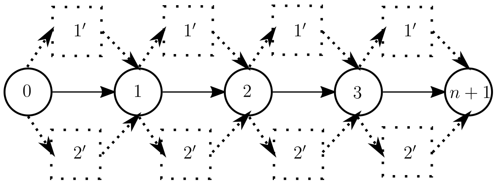

Exact replenishment facility placement
=======================================

RoutingBlocks provides an implementation of the exact replenishment facility placement algorithm described in :cite:t:`SchifferWalther2018`.
The algorithm models the problem as a resource-constrained shortest path problem (CSP) on an auxilliary graph, solved for each route in the solution independently. The auxilliary graph comprises a vertex for each customer node in the route, and allows detours to replenishment facilities by inserting copies of each facility between two consecutive customer vertices (See `Figure 1`_). We refer to :cite:t:`SchifferWalther2018` for a comprehensive description of this procedure.

.. _Figure 1:

    Figure 1: Auxilliary graph for a route with three customers. The dashed lines indicate potential detours to the replenishment facilities.

RoutingBlock's implementation of this algorithm that takes care of label
mangement, dominance-based path pruning, graph building, and other boilerplate tasks
while providing an interface to abstract problem-specific functionality, i.e., label repre-
sentation, resource extension functions, and dominance (cf. :py:class:`routingblocks.Propagator`). The design of this
interface bases on the abstractions introduced in :cite:t:`Irnich2008`.

Customizing this algorithm to a specific problem instance is analogous to implementing a custom evaluation class.
Specifically, this requires implementing the :py:class:`routingblocks.Propagator` interface and providing a custom label class.
The solver (:py:class:`routingblocks.FacilityPlacementOptimizer`) can be configured to use a custom propagator by passing it in the constructor.

.. warning::

    We recommend implementing a custom Propagators by extending the native RoutingBlocks library instead of providing a python implementation for code used beyond prototyping. See `the NIFTW source code <https://github.com/tumBAIS/RoutingBlocks/blob/develop/native/include/routingblocks/NIFTWEvaluation.h>`_ for an example.

The pseudocode listed below outlines how the FacilityPlacementOptimizer accesses the propagator interface:

.. code-block:: python
    :linenos:
    :emphasize-lines: 7, 9, 20, 24, 32, 33, 36, 42
    :caption: Pseudocode for the FacilityPlacementOptimizer, lines using the propagator interface are highlighted.

    def extract_label():
        # Find the vertex with the cheapest label in the node queue
        vertex_with_cheapest_label = find_vertex_with_cheapest_label(node_queue)
        cheapest_label = extract_cheapest_label(vertex_with_cheapest_label)
        for each label settled at vertex_with_cheapest_label:
            # Check if the label is dominated
            if propagator.dominates(settled_label, cheapest_label):
                break
            if propagator.order_before(cheapest_label, settled_label):
                # If the cheapest label is ordered before the settled label, the cheapest label cannot be dominated anymore
                # as all later settled labels will also be ordered before cheapest label
                return cheapest_label, vertex_with_cheapest_label

        # Restart the search
        extract_label()

    def optimize(route: List[VertexID]) -> List[VertexID]:
        # Prepare the propagator
        propagator.prepare(route)
        # Build the auxiliary graph from the input route, removing any existing stations
        build_auxiliary_graph(route)
        # Create the root label and add it to the first bucket
        root_label = propagator.create_root_label()
        add_unsetted_label(root_label, depot)
        # Enqueue the first vertex (depot) in the _node_queue
        enqueue(depot)
        while node_queue is not empty:
            # Extract the next cheapest label and its corresponding origin vertex from all unsettled label
            label, origin = extract_label()
            # Check if the extracted label is a final label (feasible solution) using
            if propagator.is_final_label(label):
                return propagator.extract_path(label)
            # Propagate the extracted label to all adjacent vertices in the graph
            for each vertex adjacent to origin:
                label_at_adjacent_vertex = propagator.propagate(label, origin, vertex, get_arc(origin, vertex))
                if label_at_adjacent_vertex is not None:
                    # Add the candidate label to the corresponding bucket in _buckets
                    add_unsetted_label(label_at_adjacent_vertex, vertex)
                    enqueue(vertex)
            # Place the label in the set of settled labels
            settle(label, origin, propagator.order_before)

.. autoapiclass:: routingblocks.FacilityPlacementOptimizer
    :members:
    :undoc-members:

.. autoapiclass:: routingblocks.Propagator
    :members:
    :undoc-members:

